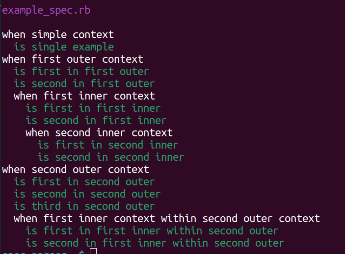
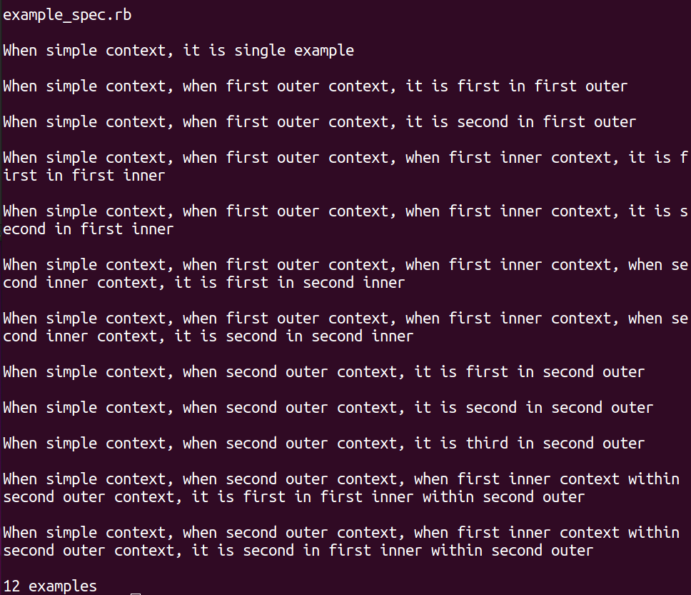

# Spec-Parser & Spec-Parser2

## How to Use

- Add to $PATH so you can run from anywhere by adding the following to
~/.bashrc.

  - export PATH="/YOUR/CUSTOM/PATH/TO/spec-parser/bin:$PATH"

- Then run using the following commands depending on what output you want.
Replace 'example_spec.rb' with your desired spec.

  - spec-parser example.spec.rb
  - spec-parser2 example.spec.rb

## Spec-Parser

Outputs your test with correct formatting without having to run it.

## Spec-Parser

Outputs your tests in paragraph form, gives the number of examples, and creates
a parsed2.txt file in your HOME directory. This file is overwritten everytime
you run the script.

##### Written by Seth Strouf 2022
